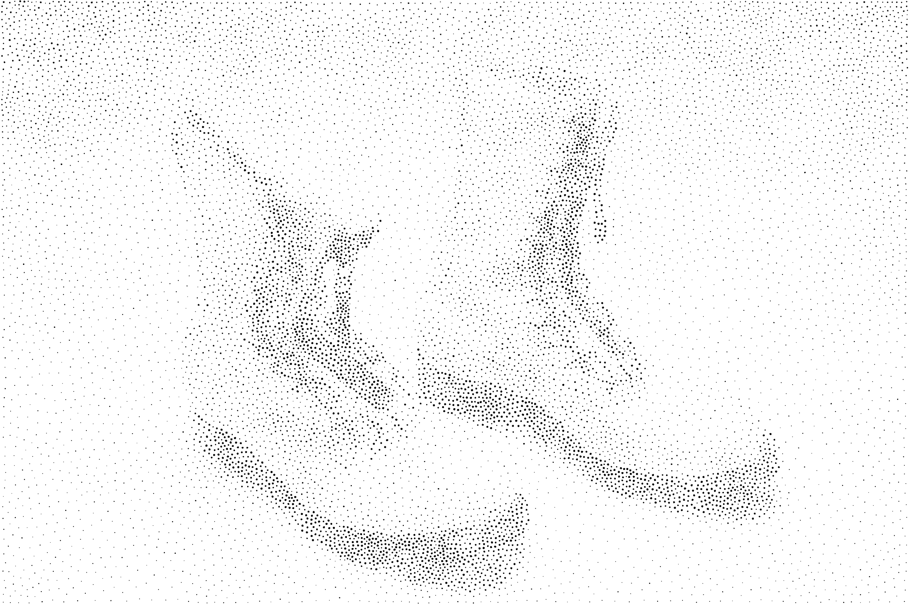

# Weighted Voronoi Stippling



This is a replication of the following article:

*Weighted Voronoi Stippling*, Adrian Secord. In: Proceedings of the 2nd
International Symposium on Non-photorealistic Animation and
Rendering. NPAR ’02. ACM, 2002, pp. 37– 43.

where the author introduced a *techniques for generating stipple drawings from
grayscale images using weighted centroidal Voronoi diagrams* as in *the
traditional artistic technique of stippling that places small dots of ink onto
paper such that their density give the impression of tone*.


## Pre-requisites

This replication was originally written and tested on OSX 10.12 (Sierra) using
Python 3.6, Numpy 1.12, Scipy 0.18, Matplotlib 2.0 and tqdm 4.10.

This branch ports the code to **Python 3.9.10** so it is compatible with the
Rhino 8 CPython runtime. The only source-level change required was replacing the
removed `scipy.misc.imread` with a small Pillow-based loader; everything else is
plain numpy / `scipy.spatial`. It has been verified with:

 * Python 3.9.10
 * Numpy 2.0
 * Scipy 1.13
 * Pillow 11.3
 * Matplotlib 3.9
 * tqdm 4.x

Create the environment with conda:

```
conda create -n stippler -c conda-forge python=3.9.10 numpy scipy matplotlib pillow tqdm
```

Original data is in the data directory and you can also obtain it from
[Adrian Secord homepage](http://cs.nyu.edu/~ajsecord/npar2002/StipplingOriginals.zip).

## Usage

```
 usage: stippler.py [--n_iter n] [--n_point n] [--save] [--force]
                    [--pointsize min,max] [--figsize w,h]
                    [--display] [--interactive] file

 Weighted Vororonoi Stippler

 positional arguments:
   file                  Density image filename

 optional arguments:
   -h, --help            show this help message and exit
   --n_iter n            Maximum number of iterations
   --n_point n           Number of points
   --pointsize (min,max) (min,max)
                         Point mix/max size for final display
   --figsize w,h         Figure size
   --force               Force recomputation
   --save                Save computed points
   --display             Display final result
   --interactive         Display intermediate results (slower)
```

## Hand-drawn pipeline (`pipeline.py`)

`pipeline.py` wraps the relaxation in a grayscale-image → stipple-output
pipeline and adds three controls that make the result read as *hand drawn*
rather than machine generated. The compute core depends only on numpy, scipy
and Pillow (Rhino-friendly); matplotlib is used only for preview rendering.

1. **Early-stopped relaxation** — fewer Lloyd iterations means the points never
   settle into the regular hexagonal lattice, so spacing stays organically
   uneven. This is the single biggest dial.
   * `--n_iter n` — hard cap on iterations (lower = looser).
   * `--epsilon d` — optional: stop when mean point movement drops below `d`.

To control **contrast** (denser blacks / cleaner whites), use `--gamma g`. It
applies a power curve `d ** g` to the density that drives point placement,
relaxation and dot size, so `g > 1` (e.g. `2.0`–`2.5`) concentrates the same
`n_point` dots into the dark areas and thins the light ones; `g < 1` flattens
the tonal range; `g = 1` is the original linear mapping. (`--threshold` is a
blunter, hard cutoff that forces lighter greys to pure white.)
2. **Varying dot size** — a min/max radius spread plus per-dot random jitter
   breaks the constant-radius "machine stipple" giveaway.
   * `--pointsize min max` — radius range (density drives the base size).
   * `--size_jitter f` — per-dot multiplicative radius noise, e.g. `0.15`.
3. **Imperfect placement & edges** — Gaussian positional jitter plus wobbly,
   non-circular dot outlines.
   * `--position_jitter s` — Gaussian noise std on final positions.
   * `--edge_noise f` — dot-edge wobble as a fraction of radius, e.g. `0.08`.
   * `--edge_segments n` — vertices per dot outline.

Output format follows the `--out` extension (`.png`, `.pdf`, `.svg`).

```
python pipeline.py ../data/boots.jpg --n_point 12000 --n_iter 8 \
       --pointsize 0.8 3.0 --size_jitter 0.2 --position_jitter 0.5 \
       --edge_noise 0.09 --seed 3 --out ../data/boots-stipple.png
```

The pipeline can also be imported as a library: `pipeline.stipple(...)` returns
a `StippleResult` carrying `points`, `radii` and per-dot `polygons` (handy for
feeding geometry into Rhino later), which `render_matplotlib`, `render_svg` and
`save_points` consume.
